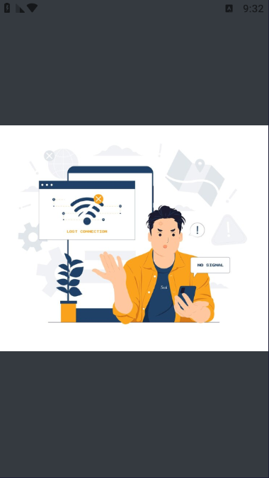

# rickandmorty

The project is designed with a multi-layered architecture, where data is managed through repositories, models, and web services, while control is handled using BLoC and Cubit, ensuring effective state management and data flow. Network connectivity is also carefully managed to ensure reliable operation even with varying internet conditions. The user interface utilizes screens and widgets to provide a cohesive and elegant user experience. The project also integrates animated text effects to enhance interaction and make the application more engaging. Each component has been carefully selected and integrated to achieve the highest levels of quality and performance, reflecting a high level of expertise and professionalism in software development.

